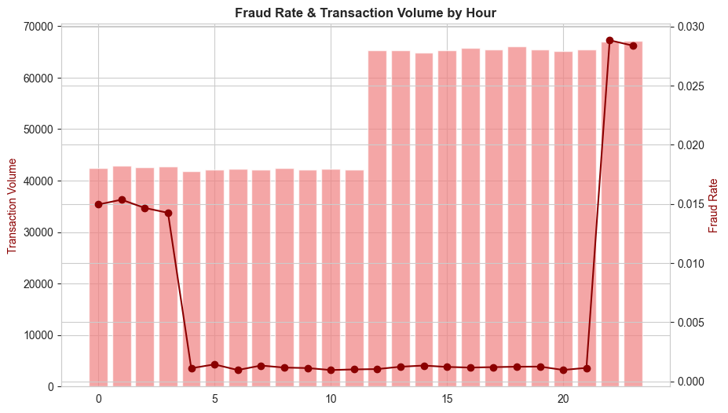

# 

# Credit Card Fraud Detection

## Project Overview

This project was developed as part of a team hackathon challenge focused on solving a real-world fintech fraud problem.

Our team of three operated in structured roles:

- **Project Manager** – Oversight, coordination, documentation  
- **Data Architect** – Data pipeline design, ETL, feature engineering  
- **Data Analyst / ML Engineer** – Exploratory analysis, hypothesis testing, modelling, evaluation  

We were tasked with analysing fraudulent credit card transactions for **NovaPay**, a UK-based fintech startup processing payments for small and medium-sized e-commerce merchants.

NovaPay has experienced:

- Rising fraudulent transactions  
- Increased financial losses  
- Growing merchant dissatisfaction  
- Excessive false positives from a rule-based detection system  

Our objective was to use data analysis and machine learning to:

1. Understand how fraud occurs
2. Identify behavioural and transactional fraud signals
3. Build a predictive model with high fraud recall
4. Deliver an interactive dashboard for operational and executive stakeholders

---

# Business Requirements

1. Identify transaction characteristics strongly associated with fraud.
2. Analyse the relationship between time, merchant category, transaction amount, and geographic distance with fraud likelihood.
3. Build a predictive model prioritising recall while maintaining acceptable precision.
4. Deliver an interactive dashboard for fraud monitoring and executive insight.

---

# Dataset

**Name:** Credit Card Transactions Fraud Detection Dataset  
**Source:** Kaggle (kartik2112)  
**Licence:** CC0 Public Domain  

## Dataset Overview

- 1.85 million simulated transactions  
- Files:
  - `fraudTrain.csv`
  - `fraudTest.csv`
- 22 columns including:
  - Transaction datetime
  - Merchant category
  - Transaction amount
  - Cardholder location
  - Merchant location
  - Fraud label  

The dataset was synthetically generated using the Sparkov Data Generation tool and simulates US cardholder transactions between January 2019 and December 2020.

It was selected due to its interpretable and business-friendly features, allowing meaningful stakeholder-focused visualisation.

---

# Methodology

We followed the **CRISP-DM (Cross-Industry Standard Process for Data Mining)** framework.

## 1. Business Understanding

- Defined fraud detection objectives
- Evaluated cost of false negatives vs false positives
- Prioritised recall to minimise missed fraud

## 2. Data Understanding

- Loaded dataset using Pandas
- Checked structure, missing values, class imbalance
- Performed exploratory data analysis (EDA)

## 3. Data Preparation

### Ethical Data Handling

Immediately removed PII columns:

- `first`
- `last`
- `street`
- `cc_num`
- `trans_num`

Excluded `gender` and `age` from modelling to reduce bias risk.

### Feature Engineering

- Extracted `trans_hour`, `trans_dayofweek`, `trans_month`
- Engineered `age` from DOB
- Created `home_merch_dist` using haversine formula
- Log-transformed `amt`
- Encoded categorical variables
- Addressed class imbalance (SMOTE / undersampling)
- Performed train-test split

Cleaned dataset exported to `data/processed/`.

---

# Data Analysis – Hypothesis Testing

---

## H1 – Time of Day and Fraud Risk

### Hypothesis

Fraudulent transactions are significantly more likely during late-night hours (22:00–04:00).

### Method

- Feature: `trans_hour`
- Late Night: 22:00–04:00
- Day/Evening: 05:00–21:00
- Statistical Test: Chi-Squared Test
- α = 0.05

### Visualisations

**Figure 1 – Fraud Rate & Transaction Volume by Hour**

**Figure 2 – Fraud Rate Trend by Hour**

### Results

- Highest fraud rate observed between 22:00–04:00
- Daytime fraud rates significantly lower
- Chi-Squared p-value < 0.05

### Conclusion

Null hypothesis rejected.  
Time of transaction is a significant fraud predictor.

---

## H2 – Merchant Category and Fraud Risk

### Hypothesis

Fraud is not evenly distributed across merchant categories.

### Visualisations

**Figure 3 – Fraud Rate by Merchant Category**

**Figure 4 – Category Distribution**

### Results

- Online and card-not-present categories show elevated fraud rates
- Essential in-person categories show lower fraud
- Chi-Squared p-value = 0.0000

### Conclusion

Null hypothesis rejected.  
Merchant category is a statistically significant fraud indicator.

---

## H3 – Transaction Amount & Geographic Distance

### Hypothesis

Fraudulent transactions have higher transaction amounts and greater home-to-merchant distance.

### Visualisations

**Figure 5 – Transaction Amount by Fraud Status**

**Figure 6 – Distance by Fraud Status**

### Results

- Fraud transactions show higher median amount
- Fraud transactions show greater geographic displacement
- Mann–Whitney U tests p < 0.05

### Conclusion

Null hypothesis rejected.  
Transaction amount and geographic distance are strong fraud predictors.

---

# Modelling

## Algorithms Used

- Logistic Regression (baseline)
- XGBoost (final model)

## Evaluation Metrics

- Precision
- Recall
- F1-score
- ROC-AUC
- Confusion Matrix
- Precision-Recall Curve

Threshold tuning performed to optimise recall while maintaining operationally acceptable precision.

---

# Dashboard Development

Two solutions developed:

- Power BI (Executive dashboard)

Link:

- Streamlit (Interactive web app)

Link: https://novapay-1368435f1858.herokuapp.com/

## Dashboard Structure

### Executive View

- Fraud rate KPI
- Trend overview

### Operations View

- Fraud by hour
- Fraud by category
- Geographic distribution
- Model performance monitoring

---

# Contributors

| Name | Role |
|------|------|
| Sundeep | Dashboard, Documentation |
| Sadiyah | Dashboard, Documentation |
| Syed | Data Architecture, ETL, Machine Learning |

---

# Conclusion

This project demonstrates how structured data analysis, hypothesis-driven exploration, and machine learning can significantly improve fraud detection compared to static rule-based systems.

The findings confirm that fraud risk is strongly influenced by:

- Time of transaction
- Merchant category
- Transaction amount
- Geographic displacement

These insights informed feature engineering and model development, resulting in a recall-focused fraud detection framework suitable for operational deployment.